# MyRuns App
## Overview
The MyRuns app is a simple fitness app for Android. It allows you to capture your runs and walks and view the stats on Google Maps. It uses sensors (viz. GPS, accelerometers) in the phone to infer your activity (e.g., running) in an automatic manner. I start by building out the UI then add GPS, Google maps, the inference model and database components. The app comprises a client that runs on the phone. This is a fun and challenging set of assignments that let’s me get experience with many of the common programming challenges when building an Android app. I can use this experience as a foundation for creating and programming your own ideas as part of the working project in the future at the end of the class. I will therefore experience design, programming, testing and publishing an app – the complete lifecycle.

## Menu
[1. MyRun1 -- The User Profile](#myrun1----the-user-profile)

[2. MyRun2 -- The User Interface (UI)](#myrun2----the-user-interface-ui)

[3. MyRun3 -- The Database](#myrun3----the-database)

[4. MyRun4 -- Google Maps](#myrun4----google-maps)

[5. MyRun5 -- Activity Recognition](#myrun5----activity-recognition)

***
### [MyRun1 -- The User Profile](https://github.com/HaojieHuang-Ryan/MyRuns/tree/MyRun1)
This iteration focuses on developing a simple UI for setting up your profile: i.e. name, email, phone number, gender and major. It works as follows: the app presents the user with an activity that allows them to input and save their profile. When the app is opened again, the saved profile information should be reloaded and displayed, allowing the user to review their data and make further changes if needed. The UI design for the activity is specified in [Settings Tab](#3-settings-tab) section. 

* You can download the apk from [here](https://github.com/HaojieHuang-Ryan/MyRuns/releases/tag/MyRun1).

***
### [MyRun2 -- The User Interface (UI)](https://github.com/HaojieHuang-Ryan/MyRuns/tree/MyRun2)
In this iteration, completed all the user interfaces, including all the activities, main activity's Action Tabs. Iteration should be able to navigate between all of the activities. Need to implement all the activities shown in [User Interface](#user-interface-walk-through). 

* You can download the apk from [here](https://github.com/HaojieHuang-Ryan/MyRuns/releases/tag/MyRun2).

***
### [MyRun3 -- The Database](https://github.com/HaojieHuang-Ryan/MyRuns/tree/MyRun3)
Complete the database design and implementation following the Database Implementation section. It should be able to add an exercise entry manually from the start tab at the main activity, view the entries in the history tab, and delete the entry from DisplayEntryActivity. It need to use a thread for reading/writing data from the database. It need to show the data in correct format. For example, if the user set their unit preference to Metric (Kilometers), all distance related data should be shown in kilometers. If you save the data in miles, you need to convert it to kilometers before showing it.
* You can download the apk from [here](https://github.com/HaojieHuang-Ryan/MyRuns/releases/tag/MyRun3).

***
### [MyRun4 -- Google Maps](https://github.com/HaojieHuang-Ryan/MyRuns/tree/MyRun4)
Design and implement the tracking services. Draw the real-time GPS trace on Google Maps using the continuous location updates. Save the traces in the database and visualize the GPS trace history on Google Maps. You should also be able to view the history trace from the history tab.
* You can download the apk from [here](https://github.com/HaojieHuang-Ryan/MyRuns/releases/tag/MyRun4).

***
### [MyRun5 -- Activity Recognition](https://github.com/HaojieHuang-Ryan/MyRuns/tree/MyRun5)
Implement activity recognition. It should train an activity classifier by collecting accelerometer data, then apply the classifier in the app.
* You can download the apk from [here](https://github.com/HaojieHuang-Ryan/MyRuns/releases/tag/MyRun5).
  
## **User Interface Walk-through**
When you launch the app you are bought to the main interface as shown in the figures below. The main UI consists of three tabs (from left to right): start, history and settings. When the app starts, it focusses on the start tab. The app offers a number of modes to record workouts -- for example, manual input which is a bit tedious and the GPS mode as shown in the figures. You can view your workout history by tapping on the history tab. In the setting tab, you can set your personal information, e.g., name, email, etc. We are going to introduce each of these three tabs in the following section.

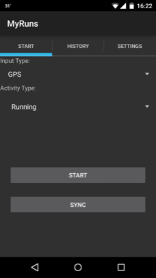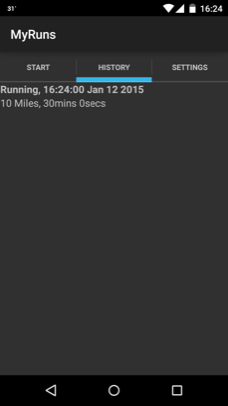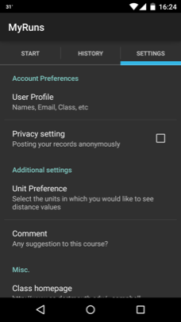

### **1. Start Tab**
You can record your work out in three ways: manual input, GPS or automatic modes. This section describes how each method works.

#### **1.1 Manual Entry Mode**
Manual entry is activated when you select “Manual Entry” for the “Input Type” using the start tab. You can specify the type of activity in “Activity Type” spinner. When you click “Start”, you will be brought to the manual input interface, where you can input the details of your workout. The table below shows the information type (e.g., heart rate), the type of widget used for data entry (e.g., TimePickerDialog) and short note on how the data could be stored (e.g., Store the timestamp in long) for data associated with a workout that the use can manually enter.

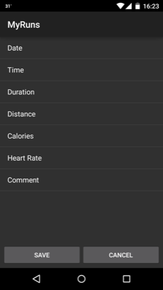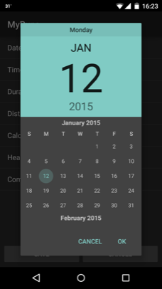

The corresponding details of exercise are listed in the following table.\
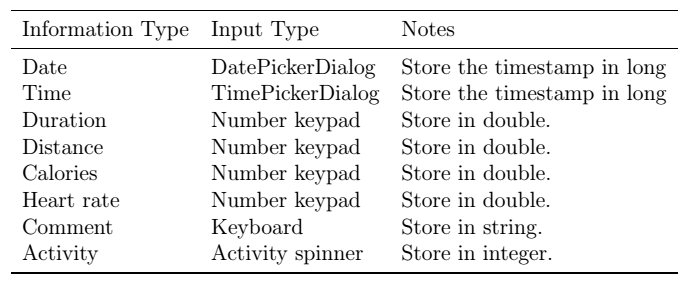

When the user clicks on any exercise/workout entry, the app should show a data entry dialog. When user taps save, the entry should be saved to the database. More on the database later.

#### **1.2 GPS Mode**
The GPS entry mode is when the user selects “GPS” for the “Input Type” on the start tab. You can specify the type of activity using the “Activity Type” spinner. When you click (it's more tapping and not clicking on a smartphone but you get my drift) “Start”, you will be brought to a map interface, where you can see your location trace and some information about your current activity. Also, a notification icon is shown in the notification area, indicating the app is tracking your location.

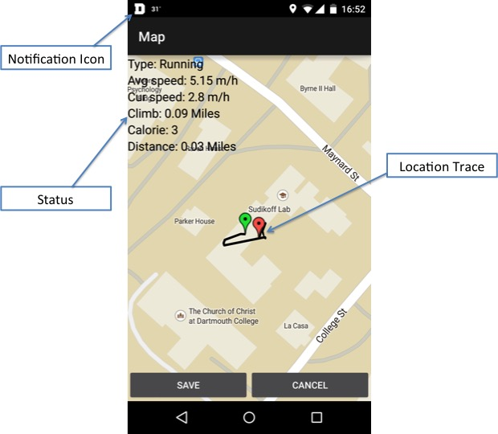

#### **1.3 Automatic Mode**
The automatic entry mode is when the user selects “Automatic” for the “Input Type” using the start tab. It is similar to the “GPS” mode except the activity type (i.e., walking, running) is automatically inferred using a classifier and features computed from the accelerometer data. The real time activity inference will be shown in the status area. The final activity type is determined as the activity label (e.g., walking) that has been inferred more times than other activity label over a defined period of time.

### **2. History Tab**
The History tab shows the list of all recorded workout entries. Each entry consists two lines: title and text. The title includes the activity type and time of the activity while text captures distance and activity duration.

When the user clicks on an entry, assuming the entry was input manually, then the app shows an interface containing the status, as shown in the screen shot below. Otherwise the app opens the map interface to show the trace. When user clicks “DELETE” in the action bar, the entry should be removed from the history tab.

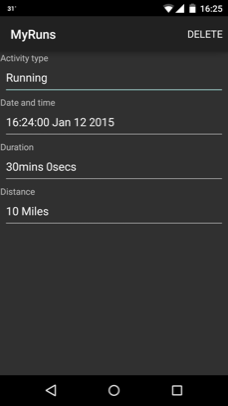

### **3. Settings Tab**
As discussed in the User Interface Walk-through section, you can set up the user profile (open a new activity), privacy setting (check box), unit preference (pop-up dialog with radio boxes) and comment (pop-up dialog with text box) in the "Settings Tab". All setting modifications should be saved automatically.

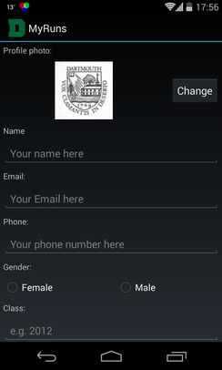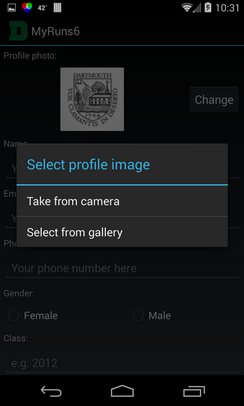

When the user clicks the “User Profile” a new view is presented, as shown in the screenshots above. The user should be able to input their photo, name, email, phone number, etc. When the user click the "Change" button, they can choose to take a picture using the camera or select one from the gallery (as shown in the middle figure). The interface should allow the user to take or get a picture. The following table shows detailed definitions of the user profile.

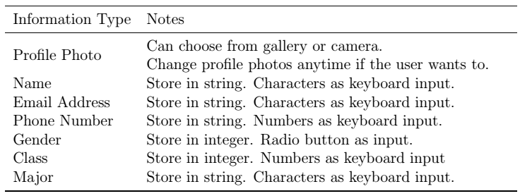